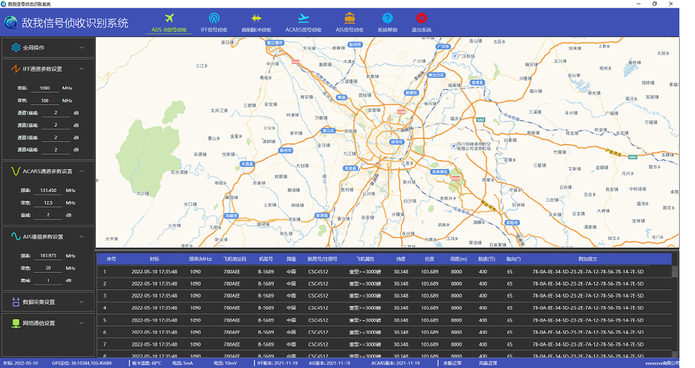

# IFFSystem

*This is an IFF signal interception and identification system, including WPF version and QT version.*

文件夹结构

 - Bin
 - Doc
 - Other
 - Src

## 目录

  1. [WPF-VERSION](#WPF) WPF版本
  1. [QT-VERSION](#QT)   QT版本

## WPF

  
    

## QT

 

**[⬆ 回到顶部](#目录)**
